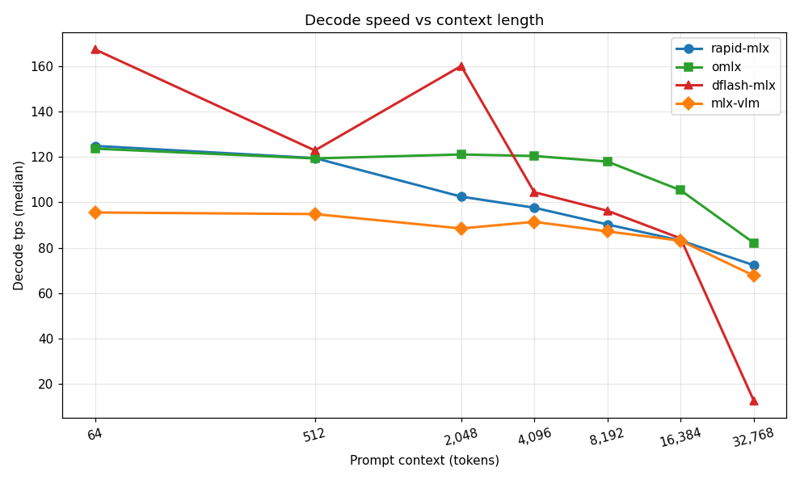
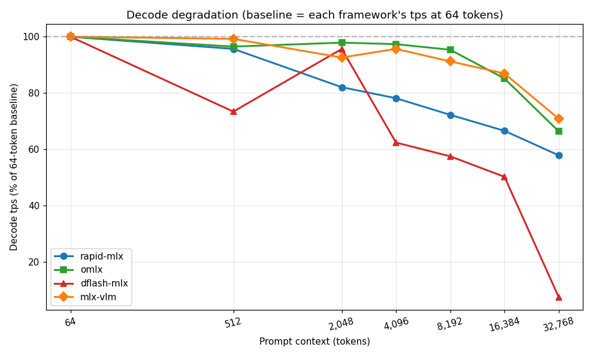
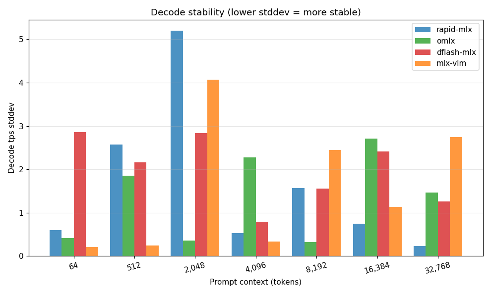
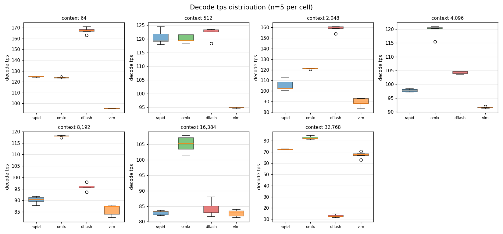
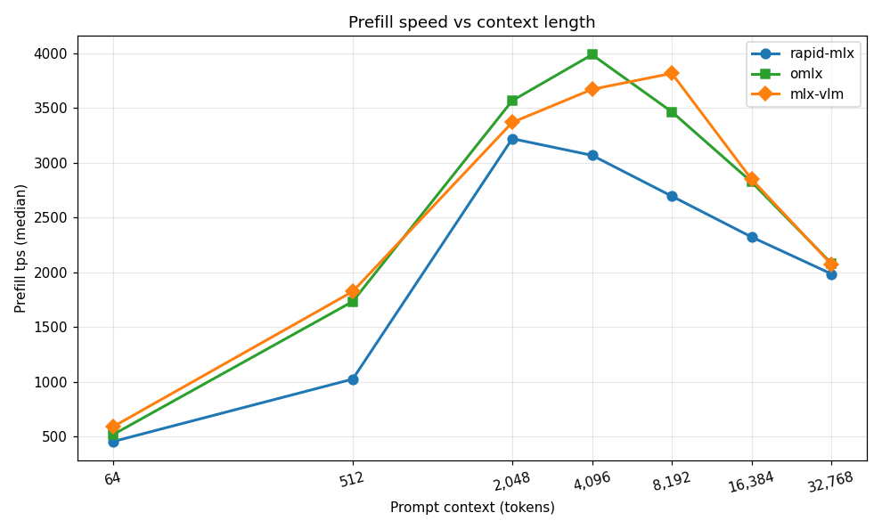
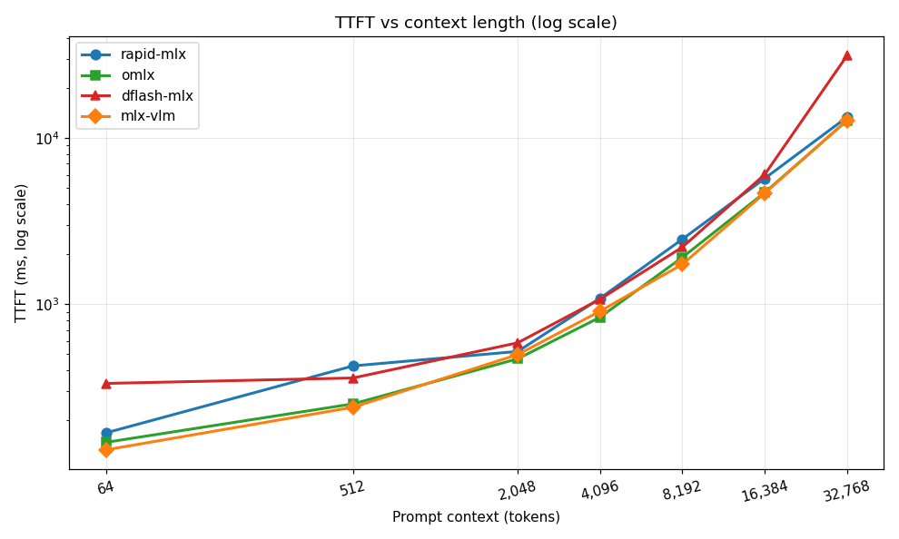

# MLX Inference Framework Benchmark Lab

[中文版 (Traditional Chinese)](README_zh.md)

## What this is

This repository contains the raw data, scripts, and analysis from a head-to-head speed comparison of four MLX inference frameworks running on Apple Silicon: **rapid-mlx**, **omlx**, **dflash-mlx**, and **mlx-vlm**. All four were tested against the same model (`mlx-community/Qwen3.6-35B-A3B-4bit`, a 4-bit quantized mixture-of-experts model with 35B total parameters and 3B active per token) across seven prompt-context lengths from 64 tokens up to 32,768 tokens, with five repeated runs per cell so we could measure both the typical performance and the variability.

The short version of the conclusion: if you mostly serve long-context workloads (RAG, document summarization, code analysis on big files), use **omlx** — it has the fastest decode speed from 4K context onward and the most stable timing of any framework tested. If your prompts are short and your output is structured or predictable, **dflash-mlx** is the fastest by a wide margin at 64–2,048 tokens because its speculative decoding hits often on those workloads. But dflash-mlx fails catastrophically at 32K, dropping to 12.6 tokens per second — roughly six times slower than the others — so you absolutely cannot use it for long-context applications. Finally, **mlx-vlm** is the only framework here that supports image, video, and audio input, but for pure text it runs about 25–30% slower than the others, so reach for it only when you actually need multimodal capability.

---

## 1. Test environment

The hardware was an Apple M5 Max with 64 GB of unified memory. Every framework loaded the same target model (`mlx-community/Qwen3.6-35B-A3B-4bit`); only dflash-mlx additionally loaded the companion draft model `z-lab/Qwen3.6-35B-A3B-DFlash` to drive its speculative decoding. All servers exposed an OpenAI-compatible streaming endpoint at `/v1/chat/completions`, and the benchmark client talked to them via that endpoint, so the comparison is genuinely apples-to-apples at the API surface even though the internals differ. The tests were run on 2026-05-09.

---

## 2. Methodology

We tested seven prompt context lengths — 64, 512, 2,048, 4,096, 8,192, 16,384, and 32,768 tokens — by generating filler text of the appropriate length and asking the model to summarize it. For each cell we ran the request five times and took the median, mean, and standard deviation, so we could distinguish "this framework is faster" from "this framework happens to have been faster on this one run." Before the timed runs we ran one full-size warm-up that we discarded, to make sure Metal kernels and weights were already on the GPU before we started measuring.

A subtle but important point: we explicitly disabled prefix caching on every framework that supports it (`--disable-prefix-cache` on rapid-mlx, `--no-cache` on omlx). Our first round of tests had wildly inflated prefill numbers — over 100,000 tokens per second on a 35B model, which is physically impossible — because the warm-up primed the prefix cache and subsequent runs reused the cached KV state instead of actually computing prefill. With caching disabled, every run measures honest cold-prefill performance.

The prompt was prefixed with `/no_think` (Qwen3's convention to suppress reasoning output), and we set `max_tokens=256`. Each framework was launched on its own server on port 8765, benchmarked, then shut down before the next framework started, so there was no memory contention between frameworks. We did not test batching or concurrent requests — these numbers reflect single-sequence latency.

The benchmark client is at [`scripts/bench_inline.py`](scripts/bench_inline.py); the chart generator is at [`scripts/plot_results.py`](scripts/plot_results.py). Raw logs are in [`logs/`](logs/) and raw per-run data is in [`data/`](data/) as JSONL.

---

## 3. Visualizations

### 3.1 Decode speed by context length



This is the headline chart. It plots median decode tokens per second against prompt context length. The picture tells the story: dflash-mlx (red) has dramatic peaks at 64 and 2,048 tokens where speculative decoding lands well, but its line cliff-dives at 32K. omlx (green) is the boring-but-effective straight line that beats everything from 4K onward. rapid-mlx (blue) starts strong at small context but degrades faster than omlx as context grows. mlx-vlm (orange) is consistently the slowest but also the flattest line.

### 3.2 Decode degradation curve



The same data normalized so each framework starts at 100% of its own 64-token baseline. This isolates "how much does decoding slow down as the KV cache grows" from "which framework is fastest in absolute terms." omlx degrades the least (from 100% to 66% of baseline at 32K), mlx-vlm is even flatter relatively but only because its baseline was already lowest. rapid-mlx loses about 42% of its speed by 32K. dflash-mlx falls off a cliff: by 32K it's running at 7.5% of its 64-token speed.

### 3.3 Decode stability (standard deviation)



This is the variability across the five runs at each context length. Lower bars mean the framework was more predictable, run to run. At short context every framework is stable (under 3 tps stddev), but as context grows you start to see real jitter. The takeaway here is that single-shot benchmarks become unreliable at 16K and beyond — your actual results in production might be ±5 tps from a single measurement, so when you're picking a framework based on long-context performance, run it multiple times yourself.

### 3.4 Per-context decode distribution



Boxplots of decode tps for each (framework, context) cell. The boxes show the interquartile range; the whiskers extend to min and max across the 5 runs. This is useful for spotting cases where the median hides a wide spread (e.g., rapid-mlx at 2,048 tokens has a noticeable spread because thinking-token output length varied across runs).

### 3.5 Prefill speed



Prefill tokens per second measures how fast the model digests the prompt before it starts generating. dflash-mlx isn't shown because its OpenAI server doesn't return `prompt_tokens` in `usage` — we'd have to back it out from TTFT. The three frameworks we can measure all peak in the 4K–8K range, which is the sweet spot for the attention-and-bandwidth tradeoff on this hardware.

### 3.6 TTFT (time to first token, log scale)



Time to first token is what your end user perceives as latency before the model starts streaming. The y-axis is log scale because TTFT spans nearly three orders of magnitude across context lengths. Note dflash-mlx jumping above the rest at 32K — that's the 31-second TTFT, more than twice everyone else.

---

## 4. Decode tps median summary table

| Prompt size | rapid-mlx | omlx | dflash-mlx | mlx-vlm |
|---:|---:|---:|---:|---:|
| 64 | 124.9 | 123.7 | **167.3** | 95.5 |
| 512 | 119.5 | 119.4 | **122.9** | 94.8 |
| 2,048 | 102.5 | 121.1 | **160.1** | 88.5 |
| 4,096 | 97.6 | **120.4** | 104.5 | 91.4 |
| 8,192 | 90.3 | **118.0** | 96.3 | 87.2 |
| 16,384 | 83.2 | **105.3** | 84.1 | 83.1 |
| 32,768 | 72.3 | **82.1** | 12.6 ⚠️ | 67.7 |

For the full statistics — mean, standard deviation, min, max — see the per-framework deep-dive reports under [`reports/`](reports/).

---

## 5. Practical recommendations

For an interactive chat application where the user types a short message and waits for a response, dflash-mlx is the right choice if you can tolerate roughly 300 milliseconds of extra time-to-first-token. Its 167 tokens-per-second decode at short context is dramatically faster than the alternatives, and the slightly worse TTFT often goes unnoticed because total response time is still dominated by the generation phase. If TTFT matters more than throughput — say, you want responses to start streaming as quickly as possible — use omlx; it has both the lowest median TTFT and the lowest TTFT variance across the small-context range.

For retrieval-augmented generation, long-document summarization, or any workload that pushes context into the 4K–32K range, omlx is the clear winner. It maintains over 100 tokens per second through 16K context, hits 82 tokens per second even at 32K, and its decode tps barely moves between runs. Frameworks that look great in short-context benchmarks may not survive the move to long context — dflash-mlx is the cautionary tale here, going from class leader to class disaster as context grows.

For code generation specifically, dflash-mlx is worth considering even at moderate context lengths because code is highly predictable and speculative decoding hits more often on structured output than on free-form natural language. We saw 160 tokens per second at 2K context where the natural-language test produced only 122 — your code-completion workload might do better than even that.

If you need to serve images, audio, or video to the model, mlx-vlm is the only choice in this set. The 25–30% slower text decode is a tax you pay for the multimodal stack, but if you need vision capability, no other framework here can deliver it. mlx-vlm does have an interesting feature we did not test: it supports `--draft-kind dflash`, which would in theory combine its strong prefill performance with dflash's decode speedup. If your context lengths are bounded under 8K, this combination might be the best of both worlds — but be aware of dflash's 32K problem.

For production deployments where stability and predictability matter more than peak speed, omlx is again the right call. Its standard deviation in TTFT and decode is the lowest in this benchmark, often by a factor of ten compared to rapid-mlx. If you're wiring up an SLA and need to make promises about p99 latency, omlx will let you make those promises more confidently.

---

## 6. Conclusions

The benchmark exposed a clear pattern: **omlx is the strongest all-around long-context framework**. It wins or ties every metric from 4K context onward, has the lowest variance, and has the gentlest decode-tps degradation curve as context grows. Setup is a little more involved (it expects models in a specific directory rather than reading from your HuggingFace cache directly), but for production use it's the most defensible default.

**dflash-mlx is the most interesting case**. Its speculative-decoding architecture genuinely delivers a 35% decode speedup at small context, but the architectural cost of running a draft model alongside the main model becomes ruinous at long context. The draft network has to process the full prompt too, and the verification phase between draft and main becomes the bottleneck. By 32K, the speculative-decoding overhead exceeds the cost of just decoding directly — and the framework's decode rate falls to 12.6 tokens per second, which is honestly unusable. Treat dflash-mlx as a specialized tool for short-context workloads with predictable output.

**rapid-mlx is the dependable middle option**. It's never the absolute fastest at any size, but it's never far from the leader either. Its main weakness is TTFT jitter at small context, where we measured a standard deviation of 136 milliseconds against a median of 169 milliseconds — meaning some requests are nearly twice as slow as others for no obvious reason. If your application can tolerate that variance, rapid-mlx is a solid choice with the most flexible feature set (paged KV cache, MTP, prefix cache, KV quantization).

**mlx-vlm is the multimodal special case**. For pure text it's the slowest in every cell. But it's the only framework here with vision and audio support, so the comparison is somewhat unfair: you don't pick mlx-vlm for raw text speed, you pick it because you need to feed it images.

The other major finding from this round was about benchmarking methodology itself. Single-shot speed numbers at long context are misleading — variance is real, and the difference between two frameworks at 32K can easily be smaller than the difference between two runs of the same framework. The five-run-with-warmup methodology used here costs about 10 extra minutes per framework, but it makes the difference between "this is faster" and "this looks faster on one run."

---

## 7. Repository layout

```
mlx_benchmark_lab/
├── README.md                     # This file (English, primary)
├── README_zh.md                  # Traditional Chinese version
├── data/                         # Raw JSONL (one run per line)
│   ├── rapid_v5.jsonl
│   ├── omlx_v5.jsonl
│   ├── dflash_v5.jsonl
│   └── vlm_v5.jsonl
├── logs/                         # Full test logs
├── scripts/
│   ├── bench_inline.py           # Streaming benchmark client
│   └── plot_results.py           # Chart generator (--lang en|zh)
├── reports/                      # Per-framework deep dives (EN + ZH)
│   ├── 01-rapid-mlx.md
│   ├── 01-rapid-mlx_zh.md
│   ├── 02-omlx.md
│   ├── 02-omlx_zh.md
│   ├── 03-dflash-mlx.md
│   ├── 03-dflash-mlx_zh.md
│   ├── 04-mlx-vlm.md
│   ├── 04-mlx-vlm_zh.md
│   ├── 99-summary.md
│   └── 99-summary_zh.md
└── charts/
    ├── *.png                     # English-labeled charts
    └── zh/                       # Chinese-labeled charts
        └── *.png
```

---

## 8. Reproducing this benchmark

The full set of steps to reproduce these numbers on your own Mac is below. Each step assumes you have Python 3.11+ and the relevant framework already installed.

```bash
# 1. Install the framework you want to test
pip install rapid-mlx       # or omlx, dflash-mlx, mlx-vlm

# 2. Download the model (HuggingFace cache)
huggingface-cli download mlx-community/Qwen3.6-35B-A3B-4bit
huggingface-cli download z-lab/Qwen3.6-35B-A3B-DFlash   # only for dflash

# 3. Launch the server (rapid-mlx example)
rapid-mlx serve mlx-community/Qwen3.6-35B-A3B-4bit \
  --port 8765 --disable-prefix-cache &

# 4. Run the benchmark
python3 scripts/bench_inline.py \
  --url http://localhost:8765 \
  --model mlx-community/Qwen3.6-35B-A3B-4bit \
  --sizes 64,512,2048,4096,8192,16384,32768 \
  --runs 5 \
  --max-tokens 256 \
  --json-out data/rapid_v5.jsonl > logs/rapid_v5.log

# 5. Generate charts
python3 scripts/plot_results.py --lang en
python3 scripts/plot_results.py --lang zh    # optional Chinese variant
```

The bench script handles streaming, parses Server-Sent Events, separates thinking tokens (`reasoning_content`) from visible content tokens, and computes per-run statistics. It also handles the case where the server doesn't expose `/v1/cache/clear` by silently swallowing the 404.

---

## 9. Limitations and follow-up work

This benchmark only covers the single-sequence case. Both rapid-mlx and omlx support continuous batching, which would change the comparison significantly under concurrent load — under heavy traffic, omlx and rapid-mlx might pull farther ahead because they can amortize prefill across simultaneous requests. dflash-mlx's speculative decoding is fundamentally single-stream and doesn't benefit from batching at all.

We tested only the 4-bit MoE model. Dense models (e.g., Qwen3-32B-Dense) and larger active-parameter MoE models would have different bottlenecks; on a dense 32B model, prefill becomes more compute-bound than memory-bound, and the relative ordering of frameworks could shift. KV-cache quantization is supported by rapid-mlx and mlx-vlm but we did not explore how it changes long-context decode performance — it would likely shrink the omlx advantage at 32K because rapid-mlx specifically benefits from quantized KV.

The mlx-vlm + dflash combination was identified but not measured. It might be the most interesting follow-up: vlm has the strongest prefill at mid-context, dflash has the strongest decode at short context, and combining them would test whether the speedups stack or interfere.

`/no_think` was honored partially — mlx-vlm and dflash-mlx fully respect it, but rapid-mlx and omlx still emit reasoning tokens. The decode tps numbers from those two therefore mix thinking-token throughput with visible-content throughput, and although the rates are similar, they're not identical. A more rigorous follow-up would set `enable_thinking=false` via the chat-template parameter rather than relying on the in-prompt convention.

dflash-mlx's OpenAI-compatible server doesn't return `prompt_tokens` in its `usage` object, which means we couldn't compute prefill tps for it without resorting to externally-tokenized prompt counts. We instead omitted dflash from the prefill chart. A small patch to dflash-serve to populate `usage.prompt_tokens` would make future comparisons cleaner.

Finally, we didn't go beyond 32K context. At 64K and 128K the KV cache becomes a major memory consumer (roughly 16 GB and 32 GB respectively for this model in fp16), and the comparison would start measuring memory pressure as much as compute speed. That's an important regime for some applications and we'd like to revisit it.
