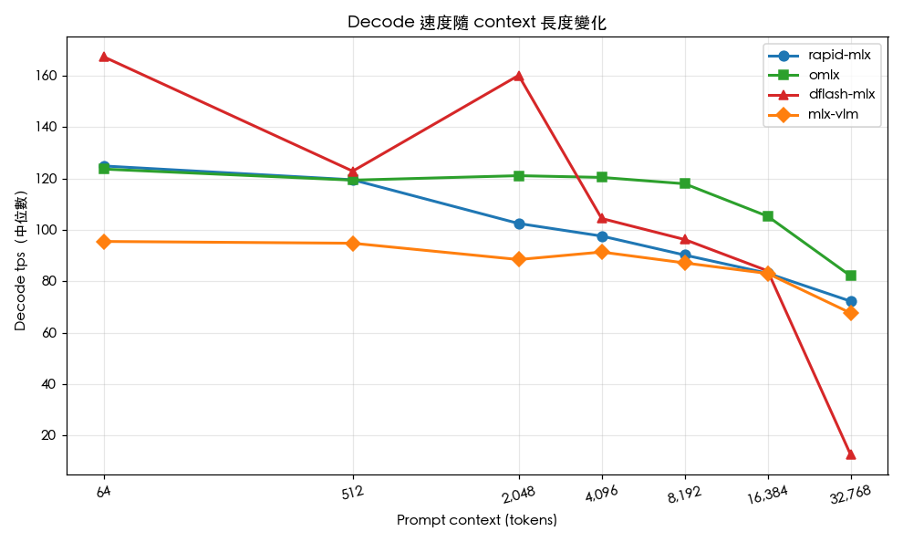
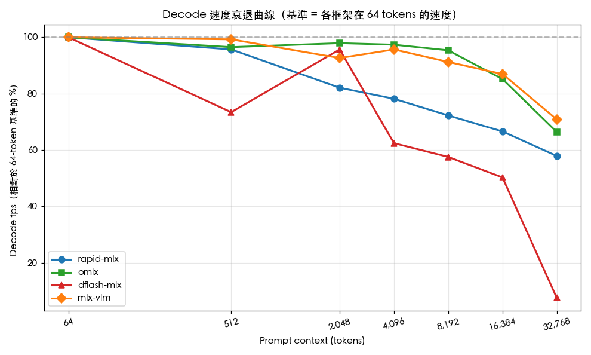
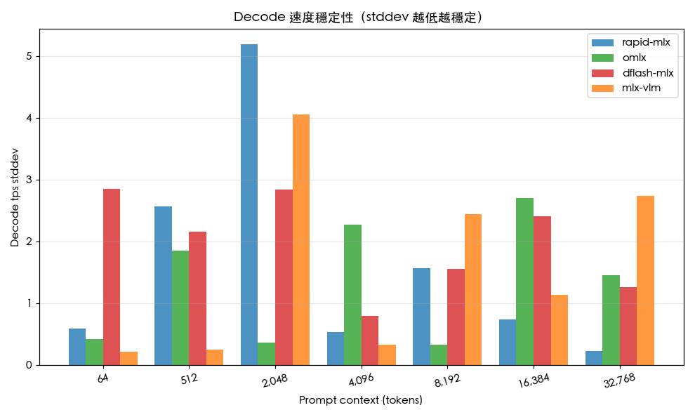
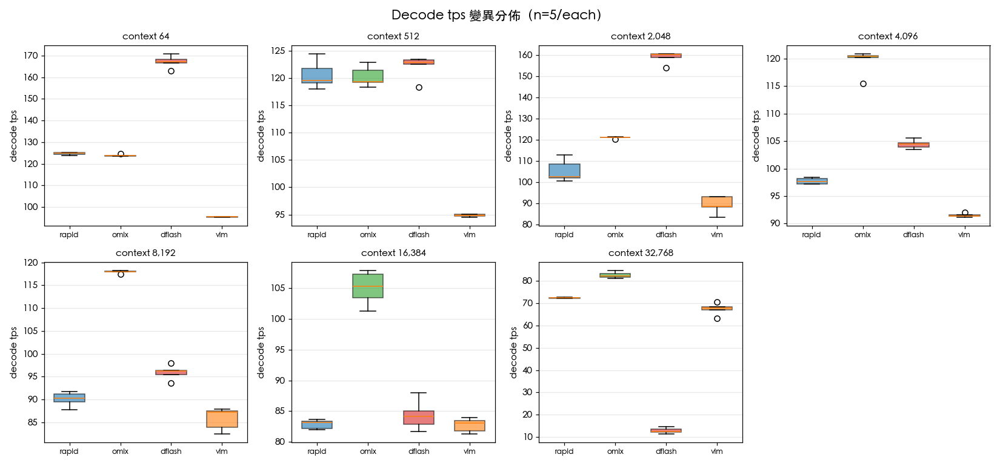
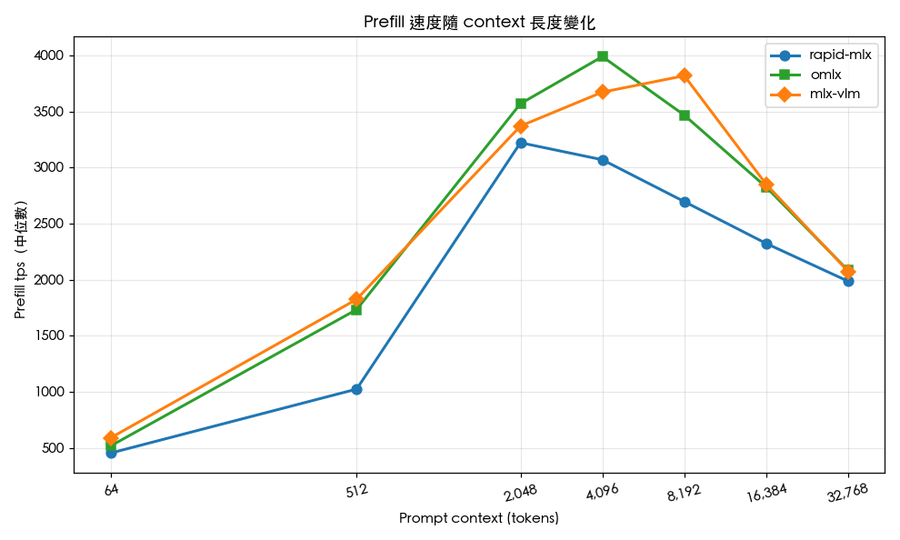
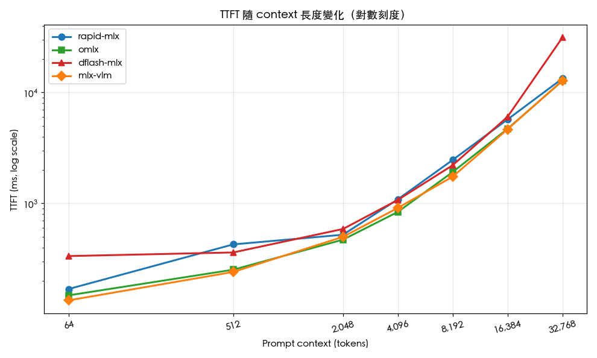

# MLX 推論框架效能比較實驗室

[English Version](README.md)

## 這份專案在做什麼

這個 repo 收錄了一份在 Apple Silicon 上對四個 MLX 推論框架做正面對決的速度測試所有原始資料、腳本與分析。受測的四個框架是 **rapid-mlx**、**omlx**、**dflash-mlx** 與 **mlx-vlm**，全部跑同一個模型（`mlx-community/Qwen3.6-35B-A3B-4bit`，這是一個 4-bit 量化的 MoE 模型，總參數 35B、每個 token 啟用 3B），覆蓋從 64 token 到 32,768 token 共七種 prompt 脈絡長度，每一格跑五次取中位數，這樣才能同時看出各框架的代表速度與穩定程度。

結論的精簡版：如果你的應用以長 context 為主（檢索增強生成、長文摘要、大檔案的程式碼分析），請選 **omlx**——它從 4K 脈絡開始就一路領先，而且在所有測試框架中時間最穩定。如果你的 prompt 短、產出格式可預測（例如程式碼或 JSON），那 **dflash-mlx** 在 64–2,048 token 區間明顯最快，因為它的 speculative decoding 在這類工作負載命中率高。但 dflash-mlx 在 32K 會災難性崩盤，decode 速度跌到每秒 12.6 token，比其他框架慢將近 6 倍，所以絕對不能拿來跑長 context 的應用。最後，**mlx-vlm** 是這次唯一支援圖像、影片與音訊輸入的框架，但純文字的速度比另外三個慢約 25–30%，所以只在你真的需要多模態時才用它。

---

## 一、測試環境

硬體是 Apple M5 Max，配 64 GB 統一記憶體。每個框架都載入同一個 target 模型 `mlx-community/Qwen3.6-35B-A3B-4bit`；只有 dflash-mlx 額外載入搭配的 draft 模型 `z-lab/Qwen3.6-35B-A3B-DFlash`，用來驅動 speculative decoding。所有 server 都暴露 OpenAI 相容的 streaming 介面 `/v1/chat/completions`，測試 client 也透過這個介面說話，所以雖然各框架內部實作不同，但在 API 層面這是真正公平的對比。測試日期是 2026-05-09。

---

## 二、測試方法

我們測了七種 prompt 脈絡長度——64、512、2,048、4,096、8,192、16,384、32,768 個 token——做法是產生對應長度的填充文字，請模型把它摘要起來。每一格重複跑五次，記錄中位數、平均值與標準差，這樣才能區分「這個框架真的比較快」和「這個框架剛好這一次比較快」。在計時開始之前，每個情境會先跑一次同尺寸但捨棄不計的 warm-up，確保 Metal kernel 與權重已經載到 GPU 上，避免冷啟動成本污染資料。

有一個容易忽略但非常關鍵的細節：我們在每個有 prefix cache 機制的框架啟動時都明確關閉它（rapid-mlx 用 `--disable-prefix-cache`、omlx 用 `--no-cache`）。第一次測試時 prefill 的數字異常離譜——35B 模型不可能達到的每秒十萬以上 token——後來才發現是 warm-up 把 prefix cache 灌滿，後續的計時 run 直接用 cache 裡的 KV 跳過實際計算。把快取關掉之後，每次 run 才是誠實的冷啟動 prefill 表現。

prompt 開頭加了 `/no_think`（Qwen3 用來抑制 reasoning 輸出的慣例），`max_tokens` 設為 256。每個框架都獨立啟在 8765 port，測完關閉再換下一個，避免記憶體相互干擾。我們沒有測 batching 或 concurrent 請求——這次的數字只代表單一 sequence 的延遲。

測試 client 在 [`scripts/bench_inline.py`](scripts/bench_inline.py)；繪圖腳本在 [`scripts/plot_results.py`](scripts/plot_results.py)。完整 log 在 [`logs/`](logs/)、每次 run 的原始資料在 [`data/`](data/) 以 JSONL 格式存放。

---

## 三、視覺化結果

### 3.1 Decode 速度隨脈絡長度變化



這張是頭條圖。x 軸是 prompt 脈絡長度，y 軸是 decode 速度的中位數。圖一打開故事就講完了：dflash-mlx（紅線）在 64 與 2,048 token 出現明顯尖峰，因為 speculative decoding 在這兩個尺寸命中得很好，但到了 32K 就懸崖式跳水。omlx（綠線）是「無聊但有效」的直線，從 4K 起一路把所有人壓在腳下。rapid-mlx（藍線）在小脈絡下表現很強，但隨著脈絡變長衰退得比 omlx 快。mlx-vlm（橘線）整段都最慢，但也是最平緩的曲線。

### 3.2 Decode 衰退曲線



把同一份資料正規化，讓每個框架自己的 64 token 速度當作 100% 起點。這樣可以把「KV cache 變大時，decode 慢多少」跟「哪個框架絕對最快」拆開來看。omlx 衰退最少，從 100% 降到 32K 時的 66%；mlx-vlm 相對曲線甚至更平，但這只是因為它的 64 token 起點本來就低。rapid-mlx 到 32K 時掉了大約 42% 的速度。dflash-mlx 則是斷崖：32K 時只剩下 64 token 速度的 7.5%。

### 3.3 Decode 穩定性（標準差）



這張顯示同一格五次 run 之間的變異程度。柱越短代表這個框架 run 與 run 之間越可預期。短脈絡下所有框架都很穩（標準差都低於 3 tps），但脈絡一拉長，抖動就跑出來了。這裡要學到的教訓是：到了 16K 以上，單次測量已經不可信了——你在實際環境裡看到的數字，和單次量到的可能差個 ±5 tps。所以當你要根據長脈絡表現挑框架時，請務必自己重複多測幾次，不要相信單一資料點。

### 3.4 各脈絡長度下的 decode 分佈



每個（框架、脈絡長度）組合的 decode tps 盒鬚圖。盒子是四分位距，鬚是 5 次 run 的最大最小值。這張圖能看到中位數隱藏的細節，例如 rapid-mlx 在 2,048 token 處的盒子明顯比較大，因為各次 run 的 thinking token 輸出長度不一致導致下游時間有波動。

### 3.5 Prefill 速度



Prefill 速度衡量模型消化 prompt 有多快，也就是「打完字到開始吐第一個字之前，模型內部在忙什麼」的速度。dflash-mlx 沒在這張圖裡，因為它的 OpenAI server 沒有在 `usage` 欄位回傳 `prompt_tokens`，要算就得從 TTFT 反推。能測到的這三個框架都在 4K–8K 區間達到峰值，這是這款硬體上 attention 計算和記憶體頻寬的甜蜜點。

### 3.6 TTFT（首字元延遲，對數刻度）



TTFT 是使用者實際感受到的延遲，從按下送出到第一個 token 出現之間的等待。y 軸用對數刻度，因為 TTFT 在不同脈絡長度下會跨過將近三個數量級。注意 dflash-mlx 在 32K 處跳到比其他人都高的位置——那是 31 秒的 TTFT，是其他框架的兩倍多。

---

## 四、Decode tps 中位數彙整表

| Prompt size | rapid-mlx | omlx | dflash-mlx | mlx-vlm |
|---:|---:|---:|---:|---:|
| 64 | 124.9 | 123.7 | **167.3** | 95.5 |
| 512 | 119.5 | 119.4 | **122.9** | 94.8 |
| 2,048 | 102.5 | 121.1 | **160.1** | 88.5 |
| 4,096 | 97.6 | **120.4** | 104.5 | 91.4 |
| 8,192 | 90.3 | **118.0** | 96.3 | 87.2 |
| 16,384 | 83.2 | **105.3** | 84.1 | 83.1 |
| 32,768 | 72.3 | **82.1** | 12.6 ⚠️ | 67.7 |

完整的統計資料——平均值、標準差、最小值、最大值——請見 [`reports/`](reports/) 下的個別框架深入分析。

---

## 五、實務選擇建議

如果你的應用是互動式 chat，使用者打一段短訊息然後等回應，**dflash-mlx** 是首選——前提是你能接受多出大約 300 毫秒的首字元延遲。它在短脈絡下每秒 167 token 的 decode 速度比其他框架快很多，而那點 TTFT 的代價通常使用者不會察覺，因為整體回應時間還是被生成階段主導。但如果 TTFT 比吞吐量更重要——例如你希望回應「立刻」開始 stream——那就用 **omlx**：它在小脈絡區間既有最低的中位數 TTFT，也有最低的 TTFT 變異。

對於檢索增強生成、長文件摘要、或是任何把脈絡推到 4K–32K 區間的工作負載，**omlx** 是無懸念的贏家。它在 16K 脈絡下還能維持每秒 100 token 以上，到 32K 也還有 82 token 每秒，而且 run 之間的 decode tps 幾乎不動。在短脈絡 benchmark 表現亮眼的框架不一定撐得過長脈絡，dflash-mlx 就是這次最警示性的反面教材：從班級第一名變成班級災難。

如果你做的是程式碼生成這種特定場景，即使脈絡到中等長度，**dflash-mlx** 仍然值得考慮，因為程式碼是高度可預測的內容，speculative decoding 在結構化輸出上的命中率比自然語言高得多。我們在自然語言測試的 2K 脈絡看到的是每秒 122 token，而程式碼工作負載可能會比 160 還更好。

如果你需要把圖像、聲音、影片送進模型，**mlx-vlm** 是這次測試中唯一的選擇。純文字 decode 慢個 25–30% 是你為了多模態 stack 付出的稅金，但如果你需要視覺能力，這裡沒有別的框架做得到。mlx-vlm 還有一個我們沒測但很有意思的功能：它支援 `--draft-kind dflash`，理論上可以把它的強 prefill 跟 dflash 的 decode 加速結合起來。如果你的脈絡長度受控在 8K 以下，這個組合可能是兩全其美——但要小心 dflash 的 32K 問題會不會被一起繼承過來。

如果是上線到 production、穩定性與可預測性比峰值速度更重要，答案還是 **omlx**。它在 TTFT 和 decode 的標準差都是這次測試最低的，常常比 rapid-mlx 低十倍。如果你要對外承諾 SLA、要保證 p99 延遲，omlx 會讓你的承諾比較有把握。

---

## 六、結論

這次 benchmark 跑出了一個清楚的型態：**omlx 是綜合表現最好的長脈絡框架**。它在 4K 以上的所有指標都贏或打平，變異最低，decode tps 隨脈絡變長的衰退曲線最平緩。它的設定門檻稍高（模型必須放在指定目錄，不能直接讀 HuggingFace cache），但對 production 用途來說是最值得信賴的預設選項。

**dflash-mlx 是這次最有意思的個案**。它的 speculative decoding 架構在小脈絡確實能拿出 35% 的 decode 加速，但長脈絡下「同時跑一個 draft 模型」的代價變得無法承擔。draft 網路也得處理整個 prompt，draft 與 main 之間的 verify 流程則成了瓶頸。到了 32K，speculative decoding 的額外開銷已經超過直接 decode 的成本，框架的 decode 速率掉到每秒 12.6 token——說實話這個數字根本不能用。請把 dflash-mlx 當成「短脈絡 + 可預測產出」的特化工具。

**rapid-mlx 是穩當的中堅**。它在任何尺寸都不是絕對最快，但也從來不會離冠軍太遠。它的主要弱點是小脈絡下的 TTFT 抖動：在 64 token 我們量到的中位數是 169 ms，但標準差高達 136 ms——意思是某些 request 不為什麼就慢了將近一倍。如果你的應用能容忍這種變異，rapid-mlx 仍然是個好選擇，而且它的功能組合最豐富（paged KV cache、MTP、prefix cache、KV 量化都有）。

**mlx-vlm 是多模態特例**。純文字場景每一格都最慢，但它是這份測試裡唯一支援視覺與音訊的框架，所以這個比較其實不太公平：你選 mlx-vlm 不是為了文字速度，而是為了把圖片餵給模型。

這一輪測試的另一個重要發現是關於 benchmark 方法本身。長脈絡下的「單次」速度數字是會誤導人的——變異是真實的，兩個框架在 32K 的差距，可能比同一個框架兩次 run 的差距還小。本次採用的「五次測量加 warm-up」方法每個框架要多花約 10 分鐘，但這多出來的成本就是「這個框架真的比較快」和「這個框架看起來比較快」的差別。

---

## 七、目錄結構

```
mlx_benchmark_lab/
├── README.md                     # 英文（主檔）
├── README_zh.md                  # 本檔（繁體中文）
├── data/                         # 原始 JSONL（每行一次 run）
│   ├── rapid_v5.jsonl
│   ├── omlx_v5.jsonl
│   ├── dflash_v5.jsonl
│   └── vlm_v5.jsonl
├── logs/                         # 完整測試 log
├── scripts/
│   ├── bench_inline.py           # streaming 速度測試 client
│   └── plot_results.py           # 圖表生成（--lang en|zh）
├── reports/                      # 個別框架深入分析（中英對照）
│   ├── 01-rapid-mlx.md
│   ├── 01-rapid-mlx_zh.md
│   ├── 02-omlx.md
│   ├── 02-omlx_zh.md
│   ├── 03-dflash-mlx.md
│   ├── 03-dflash-mlx_zh.md
│   ├── 04-mlx-vlm.md
│   ├── 04-mlx-vlm_zh.md
│   ├── 99-summary.md
│   └── 99-summary_zh.md
└── charts/
    ├── *.png                     # 英文標籤圖表
    └── zh/                       # 中文標籤圖表
        └── *.png
```

---

## 八、如何重現

要在你自己的 Mac 上重現這份數字，完整步驟如下。每一步都假設你已經裝好 Python 3.11+ 和對應的框架。

```bash
# 1. 安裝想測的框架
pip install rapid-mlx       # 或 omlx、dflash-mlx、mlx-vlm

# 2. 下載模型（HuggingFace cache）
huggingface-cli download mlx-community/Qwen3.6-35B-A3B-4bit
huggingface-cli download z-lab/Qwen3.6-35B-A3B-DFlash   # 只有 dflash 需要

# 3. 啟動 server（rapid-mlx 為例）
rapid-mlx serve mlx-community/Qwen3.6-35B-A3B-4bit \
  --port 8765 --disable-prefix-cache &

# 4. 跑 benchmark
python3 scripts/bench_inline.py \
  --url http://localhost:8765 \
  --model mlx-community/Qwen3.6-35B-A3B-4bit \
  --sizes 64,512,2048,4096,8192,16384,32768 \
  --runs 5 \
  --max-tokens 256 \
  --json-out data/rapid_v5.jsonl > logs/rapid_v5.log

# 5. 產生圖表
python3 scripts/plot_results.py --lang en
python3 scripts/plot_results.py --lang zh    # 中文版（選用）
```

bench 腳本本身會處理 streaming、解析 Server-Sent Events、把 thinking token（`reasoning_content`）和可見內容 token 分開計算、產出每次 run 的統計值。它也會自動處理 server 不支援 `/v1/cache/clear` 的情況——把回傳的 404 當成沒這回事。

---

## 九、限制與後續可做的方向

這份 benchmark 只測了單一 sequence 的情境。rapid-mlx 和 omlx 都支援 continuous batching，在多人併發下這份比較會變得很不一樣——高負載時 omlx 跟 rapid-mlx 可能會把優勢拉得更開，因為它們可以把 prefill 攤分到同時進來的多個請求上。dflash-mlx 的 speculative decoding 本質上是 single-stream，無法從 batching 受惠。

我們只測了 4-bit MoE 模型。dense 模型（例如 Qwen3-32B-Dense）和啟用更多參數的 MoE 模型瓶頸不一樣；dense 32B 的 prefill 會從記憶體頻寬瓶頸變成計算瓶頸，這時框架的相對排名就可能改變。KV cache 量化是 rapid-mlx 與 mlx-vlm 都支援的功能，但本次沒試——它應該會縮小 omlx 在 32K 的領先幅度，因為 rapid-mlx 特別會從量化 KV 受益。

mlx-vlm + dflash 的組合我們有發現但沒測到。這可能是最值得做的後續實驗：vlm 在中等脈絡的 prefill 最強、dflash 在短脈絡的 decode 最快，把兩者疊加可以驗證效果是相加還是相互干擾。

`/no_think` 在這次只被部分尊重——mlx-vlm 和 dflash-mlx 完全不輸出 thinking，但 rapid-mlx 和 omlx 仍然會吐 reasoning token。這兩個框架的 decode tps 數字其實混合了 thinking token 的速率和可見內容的速率，雖然兩者速度接近但並不完全相同。更嚴謹的後續做法是透過 chat template 的 `enable_thinking=false` 參數而不是 prompt 內的慣例。

dflash-mlx 的 OpenAI 相容 server 沒回傳 `prompt_tokens`，導致我們無法直接算 prefill tps，只能從 TTFT 反推或自己做 tokenization。我們選擇直接把 dflash 從 prefill 圖裡拿掉。如果 dflash-serve 之後願意補上 `usage.prompt_tokens`，後續比較就會乾淨很多。

最後，我們沒有測超過 32K 的脈絡。在 64K 與 128K 下，KV cache 會變成主要的記憶體佔用（這個模型 fp16 KV 大約是 16 GB 與 32 GB），這時測出來的差異會包含很多記憶體壓力的成分而不只是計算速度。對某些應用來說這個區段才是真正關鍵，是個值得回頭再做的後續題目。
